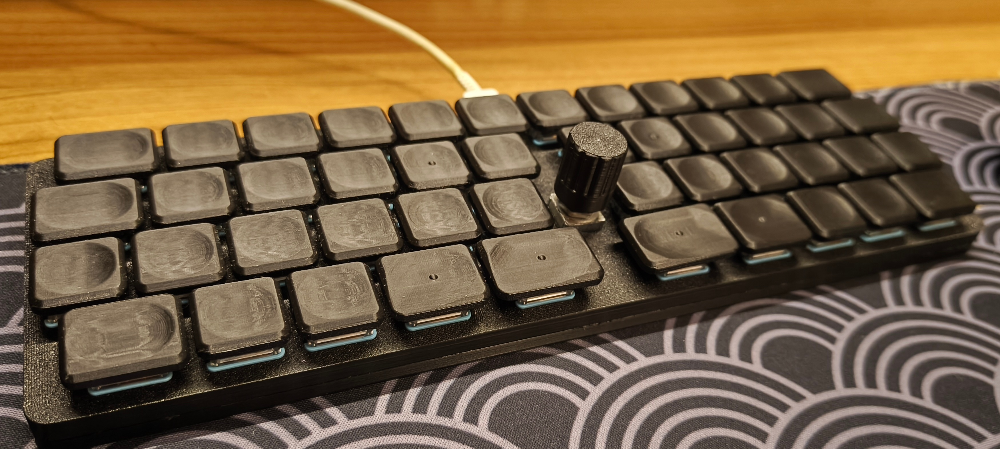

# SymStag48

A 48-key custom keyboard featuring a symmetrical staggered layout inspired by the Scotto Katana. Designed for a low profile while retaining traditional MX spacing.

## Specs

* **Layout:** 48 keys, Symmetrical Staggered
* **Switches:** Kailh Choc v1
* **Spacing:** MX Spacing (19.05 x 19.05 mm)
* **Hardware:** 1x Rotary Encoder
* **Firmware:** QMK

